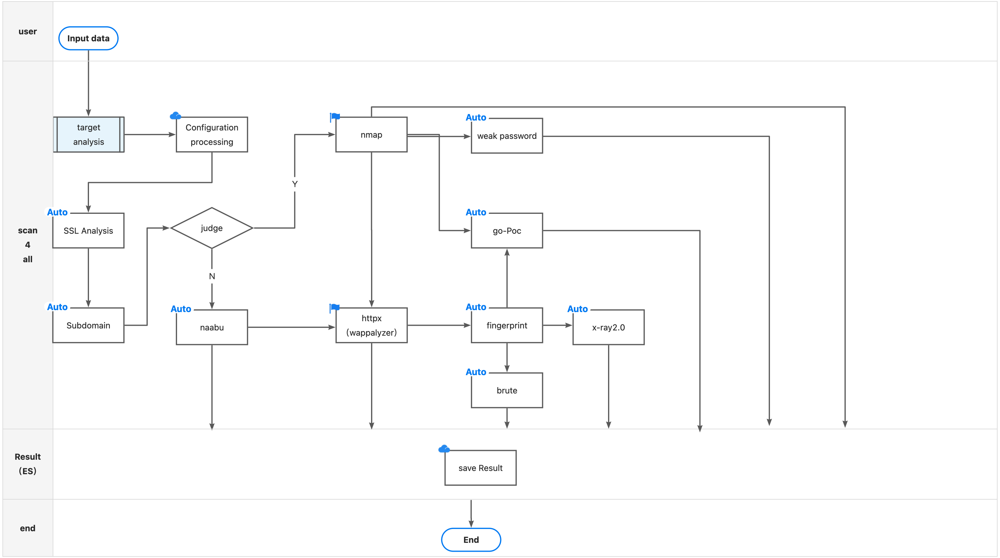

[](https://twitter.com/intent/follow?screen_name=Hktalent3135773) [](https://twitter.com/intent/follow?screen_name=Hktalent3135773) [](https://github.com/hktalent/)
<p align="center">
   <a href="/README.md">README_EN</a> •
   <a href="/static/Installation.md">Compile/Install/Run</a> •
   <a href="/static/usage.md">Parameter Description</a> •
   <a href="/static/running.md">How to Use</a> •
   <a href="/static/scenario.md">Usage Scenarios</a> •
   <a href="/static/pocs.md">POC List</a> •
   <a href="/static/development.md">Custom Scanning</a> •
   <a href="/static/NicePwn.md">Best Practices</a>
</p>

# Features
Vulnerability Scanning; 15000+ PoC vulnerability scanning; [23] types of application weak password brute-forcing; 7000+ Web fingerprints; 146 protocols with 90000+ rules for port scanning; Fuzz, HW enumeration, BugBounty tool...
<h1 align="center">

</h1>

- What is scan4all: Integrates vscan, nuclei, ksubdomain, subfinder, etc., fully automated and intelligent
  With code-level optimization, parameter optimization for these integrated projects, individual modules like vscan filefuzz have been rewritten
  In principle, do not reinvent the wheel, unless there are bugs or issues
- Cross-platform: Based on golang implementation, lightweight, highly customizable, open source, supports Linux, Windows, Mac OS, etc. (go tool dist list) 46 different chip architectures, 14 operating systems
- Supports [23] types of password brute-forcing, supports custom dictionaries, enabled via "priorityNmap": true
  * RDP
  * VNC
  * SSH
  * Socks5
  * rsh-spx
  * Mysql
  * MsSql
  * Oracle
  * Postgresql
  * Redis
  * FTP
  * Mongodb
  * SMB, also detects MS17-010 (CVE-2017-0143, CVE-2017-0144, CVE-2017-0145, CVE-2017-0146, CVE-2017-0147, CVE-2017-0148), SmbGhost (CVE-2020-0796), DCOM (msrpc, port 135, Oxid Scan)
  * Telnet
  * Snmp
  * Wap-wsp (Elasticsearch)
  * RouterOs
  * HTTP BasicAuth (HttpBasic, Authorization), includes Webdav, SVN (Apache Subversion) cracking
  * Weblogic, also enables nuclei via enableNuclei=true, supports T3, IIOP and other detection
  * Tomcat
  * Jboss
  * Winrm (wsman)
  * POP3/POP3S
- HTTP password intelligent brute-forcing enabled by default, automatically activates when HTTP password is needed, no manual intervention required
- Detects whether nmap is installed on the system, enables nmap for fast scanning via priorityNmap=true (enabled by default), optimized nmap parameters are faster than masscan
  Disadvantages of using nmap: Poor network conditions may cause incomplete results due to large traffic packets
  Using nmap additionally requires setting root password as environment variable
```bash
  export PPSSWWDD=yourRootPswd
```
  More references: config/doNmapScan.sh
  Uses naabu by default for port scanning, -stats=true to view scanning progress
  Can I skip port scanning? Skipping port scanning will disable password brute-forcing based on port fingerprint detection, and password cracking functionality will also be skipped
```bash
noScan=true ./scan4all -l list.txt -v
```
- Supports direct nmap XML result input:
```bash
./scan4all -l nmapScanResults.xml -v
```


- Fast 15000+ POC detection capabilities, PoCs include:
  * nuclei POC
  ## Nuclei Templates Top 10 statistics

|    TAG    | COUNT |    AUTHOR     | COUNT |    DIRECTORY     | COUNT | SEVERITY | COUNT |  TYPE   | COUNT |
|-----------|-------|---------------|-------|------------------|-------|----------|-------|---------|-------|
| cve       |  1430 | daffainfo     |   631 | cves             |  1407 | info     |  1474 | http    |  3858 |
| panel     |   655 | dhiyaneshdk   |   584 | exposed-panels   |   662 | high     |  1009 | file    |    76 |
| edb       |   563 | pikpikcu      |   329 | vulnerabilities  |   509 | medium   |   818 | network |    51 |
| lfi       |   509 | pdteam        |   269 | technologies     |   282 | critical |   478 | dns     |    17 |
| xss       |   491 | geeknik       |   187 | exposures        |   275 | low      |   225 |         |       |
| wordpress |   419 | dwisiswant0   |   169 | misconfiguration |   237 | unknown  |    11 |         |       |
| exposure  |   407 | 0x_akoko      |   165 | token-spray      |   230 |          |       |         |       |
| cve2021   |   352 | princechaddha |   151 | workflows        |   189 |          |       |         |       |
| rce       |   337 | ritikchaddha  |   137 | default-logins   |   103 |          |       |         |       |
| wp-plugin |   316 | pussycat0x    |   133 | file             |    76 |          |       |         |       |

**281 directories, 3922 files**.
  * vscan POC
    * vscan POC includes: xray 2.0 300+ POC, go POC, etc.; Note that xray POC detection requires fingerprint matching before triggering detection
  * scan4all POC

- Supports 7000+ web fingerprint scanning and identification:
  * httpx fingerprints
  * vscan fingerprints
    * vscan fingerprints: includes eHoleFinger, localFinger, etc.
  * scan4all fingerprints

- Supports 146 protocols with 90000+ rules for port scanning
  * Depends on nmap supported protocols and fingerprints
- Fast HTTP sensitive file detection, supports custom dictionaries
- Login page detection
- Supports multiple input types - STDIN/HOST/IP/CIDR/URL/TXT
- Supports multiple output types - JSON/TXT/CSV/STDOUT
- Highly integrable: Configurable to store results uniformly in Elasticsearch (strongly recommended)
- Intelligent SSL analysis:
  * Deep analysis, automatically associates domains in SSL information (e.g., *.xxx.com), completes subdomain traversal based on configuration, and automatically adds results to scan targets
  * Supports enabling intelligent subdomain traversal for *.xx.com in SSL information, export EnableSubfinder=true, or adjust in configuration file
- Automatically identifies domains (DNS) associated with multiple IPs, and automatically scans associated multiple IPs
- Intelligent processing:
  * 1. When multiple domains in the list share the same IP, merges port scanning to improve efficiency
  * 2. Intelligently handles HTTP exception pages, fingerprint calculation and learning
- Automated supply chain identification, analysis, and scanning
- Integrates python3 <a href=https://github.com/hktalent/log4j-scan>log4j-scan</a>
  * <a href=https://github.com/fullhunt/log4j-scan/pull/128/files>This version blocks the bug that leaks target information to DNS Log Server, preventing exposure</a>
  * Added functionality to send results to Elasticsearch for batch and blind scanning
  * Will implement golang version when time permits
    How to use?
```bash
mkdir ~/MyWork/;cd ~/MyWork/;git clone  https://github.com/hktalent/log4j-scan
```
- Intelligent honeypot detection, skips targets by default, can be enabled via EnableHoneyportDetection=true
- Highly customizable: Allows defining custom dictionaries via config/config.json, or controlling more details including but not limited to: nuclei, httpx, naabu, etc.
- Supports HTTP request smuggling vulnerability detection: CL-TE, TE-CL, TE-TE, CL_CL, BaseErr


- Supports passing Cookie parameter: Cookie='PHPSession=xxxx' ./scan4all -host xxxx.com, compatible with nuclei, httpx, go-poc, x-ray POC, filefuzz, http Smuggling, etc.

# Workflow



# How to Install
download from
<a href=https://github.com/GhostTroops/scan4all/releases>Releases</a>
```bash
go install github.com/GhostTroops/scan4all@2.8.9
scan4all -h
```
# How to Use
To install libcap on Linux:
```bash
sudo apt install -y libpcap-dev
```
on Mac:
```bash
brew install libpcap
```
## docker ubuntu
```bash
apt update;apt install -yy libpcap0.8-dev
```
## centos
```bash
yum install -yy glibc-devel.x86_64
```
### linux
too many open files
Check current open file count
```
awk '{print $1}' /proc/sys/fs/file-nr
ulimit -a
ulimit -n 819200
```
- 1. Start Elasticsearch, you can also use traditional output methods
```bash
mkdir -p logs data
docker run --restart=always --ulimit nofile=65536:65536 -p 9200:9200 -p 9300:9300 -d --name es -v $PWD/logs:/usr/share/elasticsearch/logs -v $PWD/config/elasticsearch.yml:/usr/share/elasticsearch/config/elasticsearch.yml -v $PWD/config/jvm.options:/usr/share/elasticsearch/config/jvm.options  -v $PWD/data:/usr/share/elasticsearch/data  hktalent/elasticsearch:7.16.2
# Initialize ES index, each tool has different result structures, stored separately
./config/initEs.sh

# Search syntax, for more query methods, learn Elasticsearch yourself
http://127.0.0.1:9200/nmap_index/_doc/_search?q=_id:192.168.0.111
Where 192.168.0.111 is the target to query

```
- Please install nmap before use
<a href=https://github.com/GhostTroops/scan4all/discussions>Usage Help</a>
```bash
export GOPRIVATE=github.com/hktalent
go env |grep GOPRIVATE
go build
# Precise scanning of URL list, UrlPrecise=true
UrlPrecise=true ./scan4all -l xx.txt
# Disable adaptive nmap, use naabu port scanning for internally defined http-related ports
priorityNmap=false ./scan4all -tp http -list allOut.txt -v
```

# Work Plan
- More security information collection based on crawlers, to solve and answer:
```
    1. After knowing a URL (Target), how many backend servers does it have?
       a. Different ports may correspond to different internal IPs
       b. Different contexts may correspond to different internal IPs
       c. Different HTTP response Server headers may correspond to different internal IPs
       d. In extreme cases, different parameters may route to different backend servers, corresponding to different internal IPs
```
- Refactor naabu and httpx integration methods, solving the vscan embedded code integration approach that prevents dependency package upgrades
- Integrate with metasploit-framework, under the prerequisite that the system has it installed, working with tmux, using macOS environment as best practice
- Integrate more fuzzer <!-- gryffin -->, such as integrating sqlmap
- Integrate chromedp for login page screenshots, and detection of pure JS/JS framework frontend login pages, as well as corresponding crawlers (sensitive information detection, page crawling)
- Integrate nmap-go to improve execution efficiency, dynamically parse result streams, and merge into current task waterfall
- Integrate ksubdomain for faster subdomain brute-forcing
- Integrate spider for discovering more vulnerabilities
- Semi-automatic fingerprint learning to improve accuracy; specify fingerprint name via configuration
- Load osvdb and drive execution

# Q & A
- How to use Cookie?
- libpcap related questions
more see: <a href=https://github.com/GhostTroops/scan4all/discussions>discussions</a>

# Changelog
- 2022-10-03 Pro version:
   * Optimized fuzz, completed 60k scans in 18 seconds under http2.0, while merging and removing redundant results
   * Optimization: All web scans now perform validity checks first, avoiding invalid scans and improving efficiency
   * Added several go-poc
   * Implemented distributed server functionality, distributed client implemented partial passive scanning mode encapsulation and refactoring
- 2022-07-28 Added substr, aes_cbc DSL functions for nuclei <a href="https://github.com/projectdiscovery/nuclei/releases/tag/v2.7.7">nuclei v2.7.7</a>
- 2022-08-03 Fixed nuclei Multiple instances cache goroutine leaks PR <a href=https://github.com/projectdiscovery/nuclei/issues/2386>#2386</a>
- 2022-07-20 Fix and PR nuclei <a href=https://github.com/projectdiscovery/nuclei/issues/2301>#2301</a> concurrent multi-instance bug
- 2022-07-20 Added web cache vulnerability scanner
- 2022-07-19 PR nuclei <a href=https://github.com/projectdiscovery/nuclei/pull/2308>#2308</a> added dsl function: substr aes_cbc
- 2022-07-19 Added dcom Protocol enumeration network interfaces
- 2022-06-30 Embedded private version nuclei-templates with 3000+ YAML POCs;
   1. Integrated Elasticsearch for storing intermediate results
   2. Embedded entire config directory into the program
- 2022-06-27 Optimized fuzzy matching to improve accuracy and robustness; integrated ksubdomain progress
- 2022-06-24 Optimized fingerprint algorithm; added workflow diagram
- 2022-06-23 Added ParseSSl parameter to control whether to deeply analyze DNS information in SSL by default; optimized nmap auto-adding .exe bug; optimized Windows cache file size bug
- 2022-06-22 Integrated N types of weak password detection and password brute-forcing: ftp, mongodb, mssql, mysql, oracle, postgresql, rdp, redis, smb, ssh, telnet, while optimizing support for external password dictionaries
- 2022-06-21 Decided to create scan4all
<!--
- 2022-06-20 Integrated Subfinder for domain brute-forcing, launch parameter export EnableSubfinder=true, note it's slow after launch; automatic deep traversal of domain information in SSL certificates
  Allows defining custom dictionaries via config/config.json, or setting related switches
- 2022-06-17 Optimized handling of one domain with multiple IPs, all IPs will be port scanned, then follow subsequent scanning workflow
- 2022-06-15 This version added several weblogic password dictionaries and webshell dictionaries obtained from real-world practice
- 2022-06-10 Completed core integration, including nuclei template integration
- 2022-06-07 Added similarity algorithm for 404 detection
- 2022-06-07 Added HTTP URL list precise scanning parameter, enabled via environment variable UrlPrecise=true
-->

# Thanks for Donations
- <a href=https://github.com/freeload101 target=_blank>@freeload101</a>
- <a href=https://github.com/b1win0y target=_blank>@b1win0y</a>
- <a href=https://github.com/BL4CKR4Y target=_blank>@BL4CKR4Y</a>

# Community Groups (WeChat, QQ, Telegram)
| Wechat | Or | QQchat | Or | Tg |
| --- |--- |--- |--- |--- |
||||||


## 💖Star
[](https://starchart.cc/hktalent/scan4all)

# Donation
| Wechat Pay | AliPay | Paypal | BTC Pay |BCH Pay |
| --- | --- | --- | --- | --- |
|||[paypal](https://www.paypal.me/pwned2019) **miracletalent@gmail.com**|||


<!--
export GOPRIVATE=github.com/hktalent
go env |grep GOPRIVATE

https://github.com/heartshare/go-wafw00f

git submodule add --force  https://github.com/hktalent/nuclei-templates.git config/nuclei-templates
git submodule update --init --recursive
/usr/bin/git -c protocol.version=2 submodule update --init --force --recursive
-->
